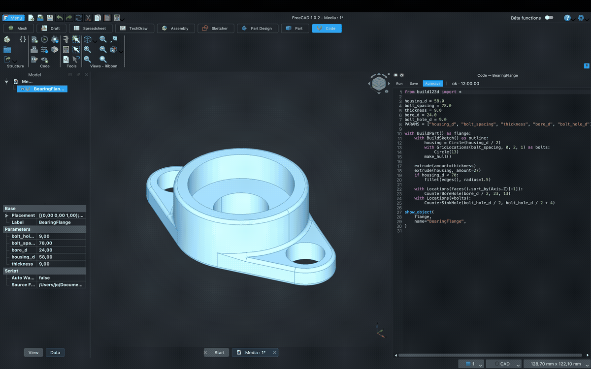
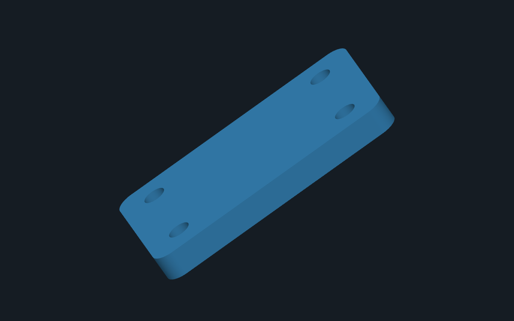
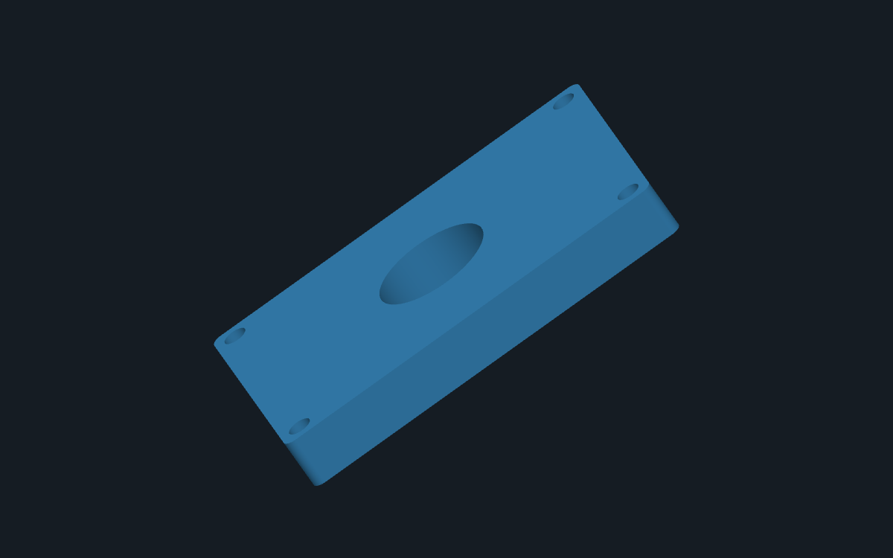
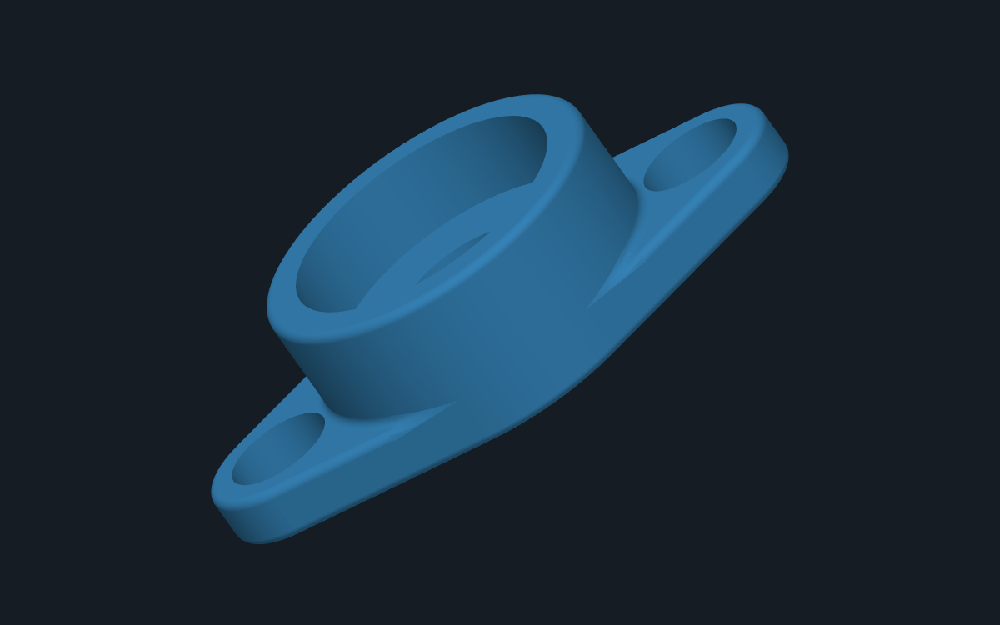

<p align="center">
  
</p>

<h1 align="center">Code Workbench for FreeCAD</h1>

<p align="center">
  <strong>Write CAD in Python. Keep the rest of FreeCAD.</strong>
</p>

<p align="center">
  Run <a href="https://github.com/gumyr/build123d">build123d</a> and
  <a href="https://github.com/CadQuery/cadquery">CadQuery</a> inside FreeCAD and turn your scripts into native, parametric document objects.
</p>

<p align="center">
  <a href="https://github.com/jokroese/freecad-code-workbench/actions/workflows/ci.yml"></a>
  <a href="LICENSE"></a>
  
</p>

<p align="center">
  
</p>
<p align="center">
  <small>Shown with <a href="https://github.com/obelisk79/OpenTheme">OpenDark/OpenPreferences</a> and <a href="https://github.com/APEbbers/FreeCAD-Ribbon">FreeCAD Ribbon UI</a>.</small>
</p>
<p align="center">
  <em>Edit the Python source or its FreeCAD properties and the native document object recomputes.</em>
</p>

Code Workbench gives Python-first CAD the document model and downstream tools of a
full CAD system. The result is not viewer-only geometry: it is a real FreeCAD object
that saves in `.FCStd`, recomputes when its parameters change, accepts expressions and
spreadsheet links, and can feed TechDraw, FEM, CAM, and Assembly workflows.

## Why Code Workbench?

- **Native FreeCAD objects.** Scripts produce `Part::FeaturePython` objects, not a
  transient preview in a separate viewer.
- **No OCCT dependency wrestling.** build123d and CadQuery run in an isolated,
  automatically managed Python environment, safely separated from FreeCAD's own
  Python and OCCT libraries.
- **Code wherever you work best.** Use the focused embedded editor or keep VS Code,
  Neovim, PyCharm, or any other editor. Saving the file hot-reloads the model.
- **Parameters become properties.** Declare ordinary Python values in `PARAMS` and
  they appear in FreeCAD's property panel, ready for expressions and spreadsheets.
- **Fast, forgiving iteration.** Autosave and recompute are built in. If an edit
  fails, the editor marks the source line while the 3D view keeps the last valid model.
- **Bring existing scripts.** `show()` and `show_object()` are compatible with
  [ocp-vscode](https://github.com/bernhard-42/vscode-ocp-cad-viewer), and top-level
  shapes are discovered automatically when nothing is explicitly shown.

## Install

> [!IMPORTANT]
> Code Workbench is not yet listed in FreeCAD's Addon Manager. Until then, install it
> directly from GitHub.

### Requirements

- FreeCAD 1.0 or later
- An internet connection on first activation
- On Linux, [`uv`](https://docs.astral.sh/uv/) (recommended), or a system Python
  3.10 or later. On Windows and macOS, Code Workbench downloads its own private
  `uv` when it is not already installed—no separate Python or developer tools are
  required.

### 1. Find or create the `Mod` folder

For FreeCAD 1.1, first check these common locations:

| Platform | Directory |
|---|---|
| Linux | `~/.local/share/FreeCAD/v1-1/Mod` |
| macOS | `~/Library/Application Support/FreeCAD/v1-1/Mod` |
| Windows | `%APPDATA%\FreeCAD\v1-1\Mod` |

The location can vary with the FreeCAD version and how it was installed. If the
corresponding path is not present, open **View → Panels → Python console** in FreeCAD
and run:

```python
App.getUserAppDataDir()
```

We want to use the returned path with `Mod` appended to it. If a `Mod` folder doesn't already exist here, create it.

### 2. Put Code Workbench in the `Mod` folder

Quit FreeCAD before installing, then choose the method that suits you.

#### From a ZIP—recommended for non-developers

Open the [latest GitHub release](https://github.com/jokroese/freecad-code-workbench/releases/latest)
and download **Source code (zip)**. Extract it, then move the entire
`freecad-code-workbench-X.Y.Z` folder into `Mod`—do not move only the folder's
contents. The resulting layout should include:

```text
/path/to/FreeCAD/Mod/freecad-code-workbench-X.Y.Z/package.xml
```

#### With Git—for developers

In a terminal, go to the `Mod` folder and clone the repository:

```console
cd /path/to/FreeCAD/Mod
git clone https://github.com/jokroese/freecad-code-workbench.git
```

### 3. Restart FreeCAD and select Code Workbench

Restart FreeCAD, then choose **Code** from the workbench selector.

### 4. Approve the first-time environment setup

On first activation, Code Workbench explains what it will download and where the
isolated environment will be created. Provisioning begins only after you approve it.
This can take a few minutes; a setup window remains visible, with detailed progress in
**View → Panels → Report view**. If setup fails, an error dialog shows the cause and
the recovery command. Later starts reuse the environment.

## Your first model

Choose **Code → New script**, save the file, and use this example:

```python
from build123d import *

length = 60.0
width = 40.0
thickness = 6.0
hole_d = 5.0
PARAMS = ["length", "width", "thickness", "hole_d"]

with BuildPart() as bracket:
    Box(length, width, thickness)
    with Locations(
        (length / 2 - 8, width / 2 - 8),
        (-length / 2 + 8, width / 2 - 8),
        (length / 2 - 8, -width / 2 + 8),
        (-length / 2 + 8, -width / 2 + 8),
    ):
        Hole(radius=hole_d / 2)
    fillet(bracket.edges().filter_by(Axis.Z), radius=4)

show(bracket)
```

The bracket appears as a Script object in the active FreeCAD document. Select it to
edit `length`, `width`, `thickness`, and `hole_d` in the property panel, or double-click
it to open the embedded editor. Save the source from any editor and the model updates.

Prefer CadQuery? Open [`examples/cq_pillow_block.py`](examples/cq_pillow_block.py).
The same workflow, parameters, colors, naming, and hot reload apply.

## The editing experience

The embedded editor is deliberately focused on the edit → recompute → inspect loop:

- Python syntax highlighting, line numbers, auto-indent, and current-line highlighting
- Live completions and call signatures from the actual kernel environment
- Autosave and recompute after a configurable idle delay
- `Ctrl+Enter` to save and run immediately
- Inline runtime diagnostics with gutter markers, wave underlines, and tracebacks
- Last-valid-model behavior when the current script fails
- A visible warning when property-panel values override defaults in the source

It is not trying to replace a full IDE. File watching is first-class, so external
editors retain their own language servers, keybindings, refactoring, source control,
and plugin ecosystems while FreeCAD supplies the live parametric model.

If a run fails, the editor marks the offending source line and makes the traceback
available in context. FreeCAD deliberately retains the geometry from the most recent
successful recompute, so a temporary coding mistake does not replace the valid model.

## How it works

FreeCAD, build123d, and CadQuery can carry binary-incompatible OCCT builds. Loading
both bindings into the same process risks symbol collisions and corruption, so Code
Workbench makes the process boundary explicit:

```text
FreeCAD process                              Managed kernel process
┌──────────────────────────┐                 ┌──────────────────────────┐
│ Code Workbench           │    JSON-RPC     │ Python 3 + OCP           │
│                          │ ◄──────────────► │ build123d + CadQuery     │
│ Native document object   │   BREP + JSON   │ Script execution         │
│ Part.Shape               │ ◄──────────────  │ show() collection        │
└──────────────────────────┘                 └──────────────────────────┘
```

Only serialized BREP geometry and JSON metadata cross the boundary. The workbench
never imports OCP, and the kernel never imports FreeCAD. This keeps the two CAD stacks
isolated while preserving exact boundary-representation geometry.

For the deeper design, protocol, and roadmap, see
[`docs/DESIGN.md`](docs/DESIGN.md).

## Examples

| API | Example | What it demonstrates |
|---|---|---|
| build123d | [`examples/bracket.py`](examples/bracket.py) | Editable dimensions, locations, holes, and fillets |
| CadQuery | [`examples/cq_pillow_block.py`](examples/cq_pillow_block.py) | `show_object()`, object naming, color, counterbores, and fillets |
| build123d | [`examples/bearing_flange.py`](examples/bearing_flange.py) | Bearing housing, panel parameters, and diagnostics |

<table>
  <tr>
    <td width="50%">
      
    </td>
    <td width="50%">
      
    </td>
  </tr>
  <tr>
    <td width="50%">
      
    </td>
  </tr>
</table>

## Status

**Code Workbench 0.2 is a functional alpha.** The complete core workflow—managed
environment, build123d and CadQuery execution, BREP transfer, native document objects,
parameters, hot reload, embedded editing, completions, diagnostics, colors, and
recompute—is implemented and exercised end to end in CI.

It is ready for curious users and contributors, but it is not yet a finished,
Addon-Manager-distributed workbench.

### Compatibility

| Component | Current support |
|---|---|
| FreeCAD | 1.0 or later |
| build123d | 0.11.1 by default; configurable in Preferences |
| CadQuery | 2.8.0 by default; configurable in Preferences |
| Kernel Python | Managed Python 3.12 with `uv`; system Python 3.10+ fallback; private `uv` bootstrap on Windows and macOS |
| Linux | Full automated tests, including headless FreeCAD end to end |
| macOS | Supported and exercised during development |
| Windows | Private `uv` bootstrap and platform paths covered by Windows CI |

### Known limitations

- Multiple shown objects currently become one compound rather than a preserved
  assembly hierarchy.
- FreeCAD's synchronous recompute means a legitimate long-running model can block the
  UI until it finishes or reaches the configurable timeout.
- Kernel requests are currently serialized, so completions wait behind a running
  script.
- Very large assemblies may eventually outgrow the current base64-in-JSON BREP
  transport.

> [!CAUTION]
> CAD scripts are arbitrary Python and run with your user privileges, like FreeCAD
> macros. Only open and execute scripts you trust.

## Tested like an integration, not a mock

Every change is checked at several levels:

- Pure-Python protocol, execution, completion, diagnostics, and provisioning tests
- Serialization tests against the real OCP/build123d/CadQuery stack
- A headless end-to-end run inside real FreeCAD: script → managed kernel → BREP →
  parametric object → recompute
- Ruff linting and a Python 3.11/3.12 core-test matrix

See the current [GitHub Actions runs](https://github.com/jokroese/freecad-code-workbench/actions).

## Development

The repository deliberately keeps the two runtimes separate:

```text
freecad/code/        Workbench code; runs inside FreeCAD and never imports OCP
kernel/              Execution kernel; runs in the managed environment and never imports FreeCAD
examples/            Ready-to-open build123d and CadQuery scripts
tests/               Unit, integration, and FreeCAD end-to-end tests
docs/DESIGN.md       Architecture decisions, constraints, and roadmap
```

To run the non-FreeCAD test suite locally:

```console
python -m venv .venv
source .venv/bin/activate
python -m pip install pytest ruff build123d==0.11.1 cadquery==2.8.0 -e ./kernel
pytest tests -q
ruff check .
```

Tests under `tests/freecad/` are driven by
[`tests/freecad/run_e2e.sh`](tests/freecad/run_e2e.sh) inside a FreeCAD environment;
the CI workflow is the reference setup.

Bug reports, focused pull requests, and field reports from different FreeCAD and OS
combinations are welcome.

## License

[LGPL-2.1-or-later](LICENSE), following the FreeCAD addon convention.
